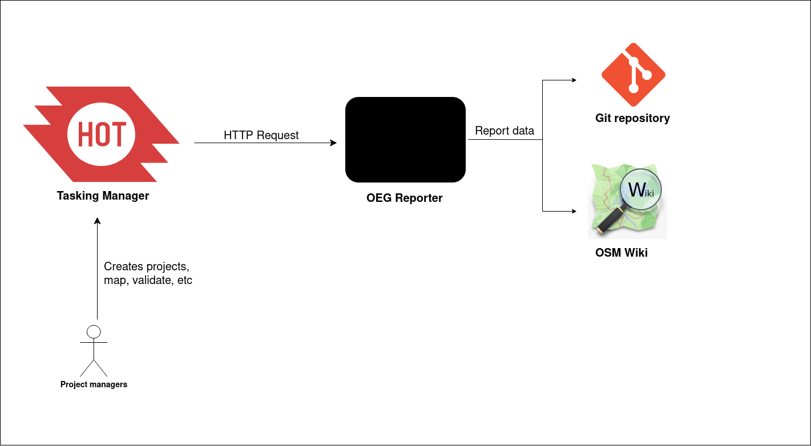

# OEG Reporter

The OEG Reporter reports data from Tasking Manager (TM) to OpenStreetMap (OSM) following the standards defined by [Organized Editing Guidelines](https://wiki.osmfoundation.org/wiki/Organised_Editing_Guidelines) (OEG). It outputs the information required by the OEG to git repository and the OSM wiki. Below is a very simple representation of how this is implemented

## Get involved!

* If You find a bug or have an idea of a new feature for the OEG Reporter you  can [open a new issue](https://github.com/hotosm/oeg-reporter/issues/new).

* If you would like to enhance the code of the Export Tool web app, a guide to installing it in a local development environment is at [docs/setup-development.md](docs/setup-development.md).
